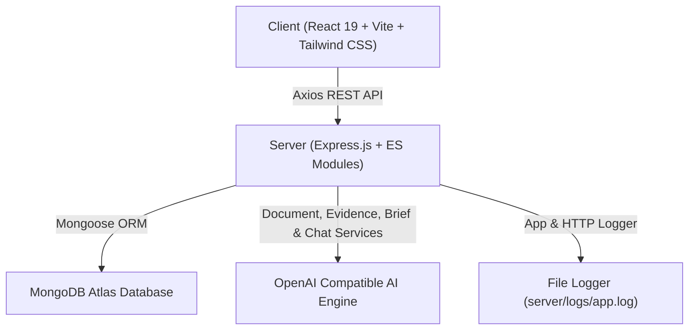

# EvidenceAI Research Assistant

Production-grade full-stack AI-powered research workspace built for software engineering and technical research workflows. Formulate research questions, generate AI execution plans, ingest source documents (PDF, TXT, MD, text paste), perform semantic text chunking, retrieve and classify empirical evidence, synthesize 11-section research briefs with traceable citations, interact with an Evidence-Grounded RAG AI Chat assistant, execute global searches, manage project versions, and export reports in PDF and Markdown formats.

---

## 🏗️ Architecture Overview

The system is engineered as a decoupled client-server architecture:



---

## ⚡ Complete Feature Matrix

1. **Research Project Management**:
   - Formulate research question (validated min 10 chars) and optional context.
   - Edit project title, question, or context via modal interface.
   - Duplicate research projects with one click.
   - Archive and unarchive workspace projects.
   - Cascade project deletion removing associated documents, plans, evidence, briefs, and chat history.
2. **AI Research Execution Plan Engine**:
   - OpenAI-compatible plan generator creating 3–7 structured steps with Title, Description, and Objective.
   - Interactive plan editor: reorder steps (move up/down), edit titles/descriptions, delete steps, add custom steps.
   - Tracks `edited=true` status automatically upon step modification.
   - Plan approval locking the research plan (`approved=true`, `approvedAt=now`).
3. **Document Ingestion & Processing**:
   - Upload PDF (via `pdf-parse`), TXT, Markdown (.md), or paste raw text.
   - Drag & drop dropzone + raw text paste interface.
   - SHA256 file hashing (`filename + rawText`) blocking duplicate uploads (409 Conflict).
   - Semantic text chunker (~500 words per chunk with 75-word overlap, tracking word start/end indices).
4. **Semantic Evidence Retrieval & Classification**:
   - Evaluates document chunks against approved plan steps.
   - Classifies evidence items as `Supporting`, `Conflicting`, or `Insufficient`.
   - Returns confidence score (%) and LLM reasoning statement.
   - Grouped evidence viewer with search and classification filter buttons.
5. **Evidence-Based Research Brief Generation**:
   - Synthesizes 11 structured sections grounded ONLY in stored empirical evidence:
     1. Executive Summary
     2. Research Question
     3. Research Context
     4. Methodology
     5. Key Findings
     6. Supporting Evidence
     7. Conflicting Evidence
     8. Areas with Insufficient Evidence
     9. Unanswered Questions
     10. Limitations
     11. Overall Conclusion
   - Explicit inline citation tags (`docName`, `chunkNumber`, `excerpt`, `evidenceId`).
   - Claim validation filtering out unsupported claims.
   - Evidence Quality breakdown (`High`, `Medium`, `Low`).
   - Gap Analysis (missing, weak, contradictory evidence, recommendations).
   - 5–10 intelligent follow-up questions.
6. **Brief Version History & Multi-Format Export**:
   - Incremental version history (`v1.0`, `v2.0`).
   - Narrative regeneration creating fresh versions without overwriting previous reports.
   - Version switching and restoration via dropdown selector.
   - Export to PDF/HTML, Markdown (.md), or Copy to Clipboard.
7. **Evidence-Grounded RAG AI Chat**:
   - Follow-up Q&A chat interface grounded strictly in stored empirical evidence.
   - Never hallucinates external knowledge; reports insufficient evidence when sources are lacking.
   - Returns explicit document citations and logs response latency (`latencyMs`).
   - Features quick suggested prompts, message copying, typing indicators, and history clearing.
8. **Universal Global Search**:
   - Real-time search across Research Projects, Ingested Documents, Evidence Items, Briefs, and Chat Messages with filter controls.
9. **Workspace System Settings**:
   - Configure default LLM model (`gpt-4o-mini`, `gpt-4o`, `claude-3-5-sonnet`, `deepseek-r1`), LLM temperature, citation style (`IEEE`, `APA`, `Harvard`), retrieval chunk thresholds, and export format defaults.
10. **Accessibility & Responsive Polish**:
    - Built to WCAG AA accessibility standards with a 16px base font size, high-contrast dark palette, min 44×44px touch targets, and responsive flex/grid layouts.

---

## 🔌 Complete REST API Reference

| Method | Endpoint | Description | Status |
| :--- | :--- | :--- | :--- |
| `GET` | `/health` | Server health check, uptime, environment | ✅ Operational |
| `POST` | `/api/research` | Create research project with question validation | ✅ Operational |
| `GET` | `/api/research/:id` | Retrieve research project & populated current plan | ✅ Operational |
| `PUT` | `/api/research/:id` | Update title, question, or context | ✅ Operational |
| `POST` | `/api/research/:id/duplicate` | Duplicate research project | ✅ Operational |
| `PUT` | `/api/research/:id/archive` | Toggle project archive status | ✅ Operational |
| `DELETE` | `/api/research/:id` | Cascade delete project and associated data | ✅ Operational |
| `GET` | `/api/history` | List historical research projects | ✅ Operational |
| `POST` | `/api/plan/generate` | Generate AI research execution plan | ✅ Operational |
| `PUT` | `/api/plan/:id` | Edit plan steps (`edited=true`) | ✅ Operational |
| `POST` | `/api/plan/:id/approve` | Approve plan & update Research status | ✅ Operational |
| `POST` | `/api/documents/upload` | Upload PDF/TXT/MD file or paste raw text | ✅ Operational |
| `POST` | `/api/documents/process` | Trigger text extraction & chunking | ✅ Operational |
| `GET` | `/api/documents/:researchId` | List documents for a research project | ✅ Operational |
| `DELETE` | `/api/documents/:id` | Delete document, chunks & evidence | ✅ Operational |
| `POST` | `/api/evidence/retrieve` | Semantic evidence retrieval & classification | ✅ Operational |
| `GET` | `/api/evidence/:researchId` | Get classified evidence for a project | ✅ Operational |
| `POST` | `/api/research-brief/generate` | Generate initial 11-section research brief | ✅ Operational |
| `GET` | `/api/research-brief/:researchId` | Get latest brief version for a project | ✅ Operational |
| `GET` | `/api/research-brief/version/:versionId` | Get specific brief version by ID | ✅ Operational |
| `GET` | `/api/research-brief/versions/:researchId` | Get brief versions list for a project | ✅ Operational |
| `POST` | `/api/research-brief/regenerate` | Regenerate narrative & save new version | ✅ Operational |
| `POST` | `/api/research-brief/export/pdf` | Export formatted PDF/HTML report | ✅ Operational |
| `POST` | `/api/research-brief/export/markdown` | Export Markdown report | ✅ Operational |
| `POST` | `/api/chat/message` | Send prompt to RAG Chat Engine & get cited response | ✅ Operational |
| `GET` | `/api/chat/:researchId` | Fetch chat conversation history | ✅ Operational |
| `DELETE` | `/api/chat/:researchId` | Clear chat conversation history | ✅ Operational |
| `GET` | `/api/search` | Universal global search across all entities | ✅ Operational |
| `GET` | `/api/settings` | Retrieve user workspace settings | ✅ Operational |
| `PUT` | `/api/settings` | Update user workspace settings | ✅ Operational |

---

## 🗄️ Database Schemas Summary

1. **`Research`**: `title`, `researchQuestion`, `context`, `status` (`'DRAFT'`, `'PLAN_GENERATED'`, `'PLAN_APPROVED'`, `'COMPLETED'`), `currentPlan` (ref `ResearchPlan`), `isArchived`, `tags`, timestamps.
2. **`ResearchPlan`**: `researchId`, `generatedBy`, `steps` array (`id`, `title`, `description`, `objective`, `order`, `status`), `approved`, `approvedAt`, `edited`, `version`, timestamps.
3. **`Document`**: `researchId`, `filename`, `mimeType`, `fileSize`, `rawText`, `status` (`'UPLOADED'`, `'PROCESSING'`, `'PROCESSED'`, `'FAILED'`), `hash` (SHA256), `chunkCount`, timestamps.
4. **`DocumentChunk`**: `documentId`, `researchId`, `chunkNumber`, `text`, `startPosition`, `endPosition`, `embedding`, timestamps.
5. **`Evidence`**: `researchId`, `planStepId`, `documentId`, `chunkId`, `excerpt`, `classification` (`'Supporting'`, `'Conflicting'`, `'Insufficient'`), `confidence`, `reason`, timestamps.
6. **`BriefVersion`**: `researchId`, `version`, `title`, `summary`, `sections` array (`heading`, `content`, `citations`), `evidenceQuality` (`highCount`, `mediumCount`, `lowCount`), `gapAnalysis` (`missing`, `weak`, `contradictory`, `recommendations`), `followUpQuestions`, `snapshot`, `settings`, timestamps.
7. **`ChatMessage`**: `researchId`, `role` (`'user'`, `'assistant'`), `content`, `citations` array, `latencyMs`, timestamps.
8. **`UserSettings`**: `userId`, `defaultModel`, `theme`, `citationStyle`, `retrievalCount`, `temperature`, `exportFormat`, timestamps.

---

## 💻 Local Development Setup

### Prerequisites
- Node.js v18+
- npm v9+

### Environment Setup
Create a `.env` file in the root or `server/` directory:

```env
PORT=5000
NODE_ENV=development
CLIENT_URL=http://localhost:5173
MONGODB_URI=mongodb+srv://<username>:<password>@cluster0.mongodb.net/evidence_ai
OPENAI_API_KEY=your_openai_api_key_here
OPENAI_BASE_URL=https://api.openai.com/v1
OPENAI_MODEL=gpt-4o-mini
```

*(Note: If `MONGODB_URI` or `OPENAI_API_KEY` are unconfigured, the application runs in standalone mode with dual-mode in-memory persistence and a structured AI fallback generator).*

### Installation & Execution Commands

```bash
# Install backend and frontend dependencies
npm run install:all

# Run backend development server
npm run dev:server

# Run frontend development client
npm run dev:client

# Run complete test suite across all phases
node server/tests/phase2.test.js
node server/tests/phase3.test.js
node server/tests/phase4.test.js
node server/tests/phase_final.test.js

# Build client for production
npm --prefix client run build
```
